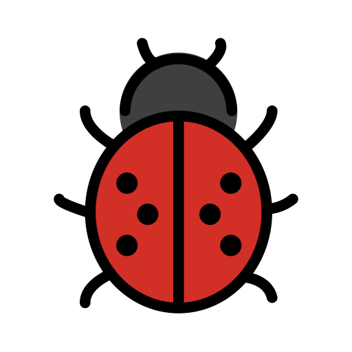
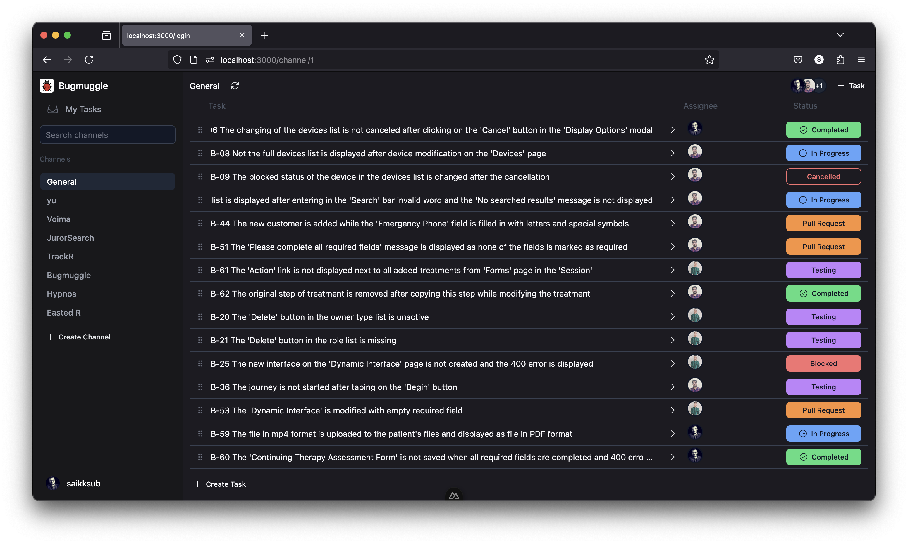

<br />


### Bugmuggle - Opensource Bug Tracking Web Application
Bugmuggle is a simple, easy to use bug tracking web application built with Nuxt.js. It's designed to be a lightweight and flexible bug tracking system that can be easily customized to fit your needs. It uses the Github API to authenticate users and access channels like sections to track and manage issues.

Bugmuggle is built with [Nuxt](https://nuxt.com) and deployed on Cloudflare Pages using [NuxtHub](https://hub.nuxt.com). All the data is stored in Cloudflare D1.

<a href="https://hello.nuxt.dev">

</a>

## Setup
1. Rename `.env.example` to `.env` in the root of the project.

2. Open the `.env` file and populate the following:
    ```bash
    NUXT_SESSION_PASSWORD=password-with-at-least-32-characters
    NUXT_OAUTH_GITHUB_CLIENT_ID=your_github_client_id
    NUXT_OAUTH_GITHUB_CLIENT_SECRET=your_github_client_secret
    ```
    You can get your Github Client ID and Client Secret from your [Github's developer profile settings](https://github.com/settings/developers)
    Follow this guide to [create a new OAuth App](https://github.com/bugmuggle/bugmuggle/wiki/Setup-GitHub-OAuth-Application)


3. Make sure to install the dependencies with [pnpm](https://pnpm.io/installation#using-corepack):
    ```bash
    pnpm install
    ```

## Development Server

Start the development server on `http://localhost:3000`:

```bash
pnpm dev
```

## Production

Build the application for production:

```bash
pnpm build
```

## Deploy


Deploy the application on the Edge with [NuxtHub](https://hub.nuxt.com) on your Cloudflare account:

```bash
npx nuxthub deploy
```

Then checkout your server logs, analaytics and more in the [NuxtHub Admin](https://admin.hub.nuxt.com).

You can also deploy using [Cloudflare Pages CI](https://hub.nuxt.com/docs/getting-started/deploy#cloudflare-pages-ci).

## Stay in touch
[LinkedIn](https://www.linkedin.com/showcase/bugmuggle/)

## Trademark
**Logo**

The logo is sourced from [OpenMoji](https://openmoji.org/library/emoji-1F436/). License: CC [BY-SA 4.0](https://creativecommons.org/licenses/by-sa/4.0/)
